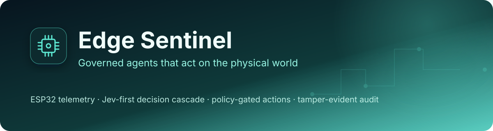
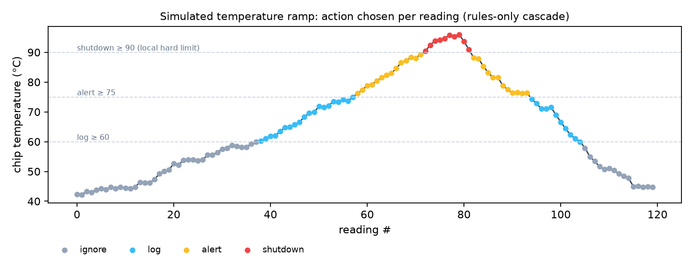
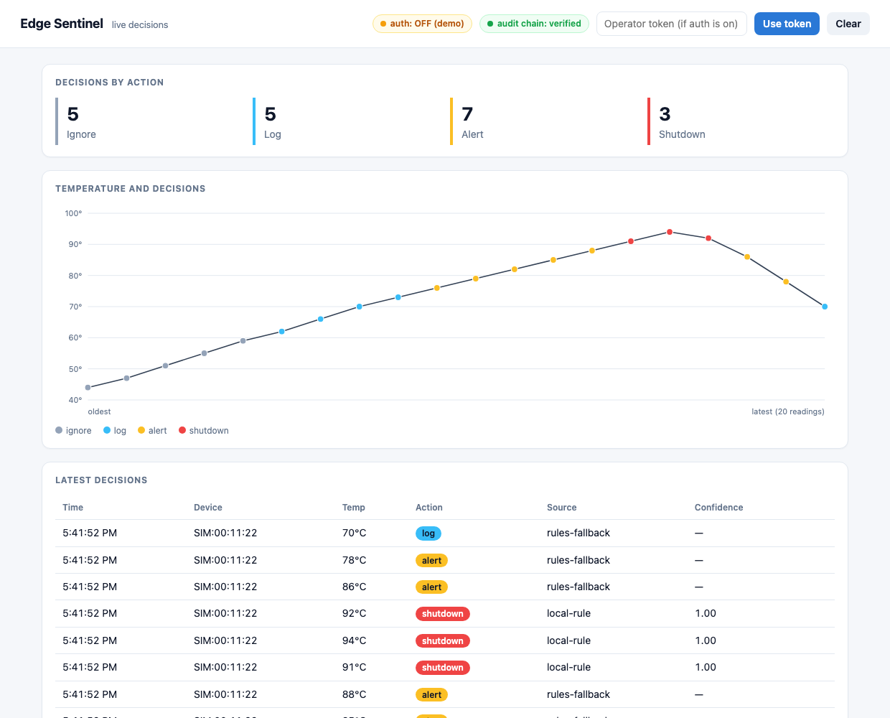
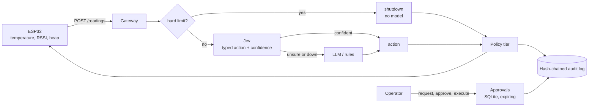

# Edge Sentinel

### *Governed agents that act on the physical world*

<div align="center">

[](https://www.python.org/)
[](firmware/)
[](agent/app.py)
[](https://typesafe.ai/blog/introducing-system-one-models-and-jev)
[](agent/tests/)

</div>

An ESP32 streams telemetry to a gateway. A decision cascade picks an action
(`ignore`, `log`, `alert`, `shutdown`): a local hard limit first, then
[Jev](https://typesafe.ai/blog/introducing-system-one-models-and-jev) for fast
typed decisions, then an LLM only when Jev is unsure. Every action passes a
policy layer and lands in a hash-chained audit log.

**Why this exists:** the agent projects in this portfolio govern what software
agents may do, with approvals, budgets and audit trails. This one asks what
changes when the action touches hardware: a wrong call can cost a device, and
the model's answer cannot be the thing that decides how risky it is. It is also
where I am learning embedded work (ESP32) and a new class of model (Jev, which
returns typed decisions with confidence instead of text).

> **Why this repo exists:** to build the governance guarantees my earlier repos
> describe but do not fully enforce. A code review of them found a policy that
> trusts a model's own risk label, approvals that anyone can grant to
> themselves, and approvals that nothing checks before executing. Here those
> are tested behaviors ([ADR 001](docs/adr/001-model-proposes-policy-decides.md)).

> **Related work in this portfolio:** the cascade follows
> [switchboard](https://github.com/PlainJane20/switchboard) (deterministic
> routing with an LLM fallback). The propose, approve, execute flow follows
> [it-agent-platform](https://github.com/PlainJane20/it-agent-platform), and the
> fail-closed table follows
> [agent-control-tower](https://github.com/PlainJane20/agent-control-tower).
> [jev-agent-router](https://github.com/PlainJane20/jev-agent-router) benchmarks
> Jev against an LLM on routing. Planned: model per-hop latency as a critical
> path with [critical-path-radar](https://github.com/PlainJane20/critical-path-radar),
> and score device health like [exec-status-rollup](https://github.com/PlainJane20/exec-status-rollup).

## At a glance

| | |
|---|---|
| **Problem** | An agent that acts on hardware must stay safe when its models are slow, wrong or down |
| **Approach** | Local hard limit, then Jev, then LLM on low confidence, then rules; risk comes from a fixed table, not the model |
| **Proof** | 35 offline tests, plus a live run against Jev: 94% policy agreement on 48 readings, 31 of 31 correct when confident |
| **Output** | A typed decision per reading, token-authenticated approvals, a live dashboard, and an audit chain that can be verified |
| **Not yet** | Flashed hardware, relay delivery, end-to-end latency over Wi-Fi, an LLM fallback run |

## Competencies demonstrated

| Competency | Observable evidence |
|---|---|
| Systems design under uncertainty | Every model failure degrades to rules; critical readings never wait on a model |
| Risk and governance | Per-operation policy table, unknown operations denied, single-use expiring approvals |
| Auditability | Hash-chained log storing the reading, source and confidence behind each decision |
| Hardware integration | ESP32 firmware and a written interface contract |
| Measurement discipline | Unmeasured hops are labeled unmeasured; numbers state what they exclude |

Full mapping to code and tests: [`docs/COMPETENCY_MAP.md`](docs/COMPETENCY_MAP.md).

## Real output

Produced by the real cascade on simulated data (a temperature ramp, rules only,
no models). Regenerate with `benchmarks/make_figures.py`.



The dashboard (`/dashboard`), captured with headless Chrome against a local
gateway (rules only, auth off, so the badge says demo). The 20 readings were a
scripted temperature ramp posted to `POST /readings`, chosen to pass through all
four actions. They are simulated, not from a device. Random runs of
`simulate.py` drift upward slowly and may show no alerts:



### Jev on sensor readings (live API)

Run on 2026-10-05 with `benchmarks/sensor_eval.py`: 48 readings (12 temperatures
including the 59/60, 74/75 and 89/90 boundaries, across good and bad Wi-Fi and
heap), one run, escalation threshold 0.8. Labels come from the same written policy
that is in Jev's instructions, so this measures **policy-following**, not
independent accuracy.

| Metric | Result |
|---|---|
| Agreement with the policy | 45 of 48 (94%) |
| Confident (>= 0.8) | 31 of 48 (65%) |
| Accuracy when confident | 31 of 31 |
| Confident but wrong | 0 |
| Escalated to fallback | 17 of 48 (35%) |
| Latency (sequential, includes network from my laptop) | p50 125 ms, p95 167 ms |

All three misses were low-confidence (0.38, 0.42, 0.75) and would have been escalated,
which is the behavior the cascade depends on. Raw rows are in
`benchmarks/sensor_eval_results.json`.

Gateway-side cost, measured in-process on an Apple M4 Pro over 2,000 readings
(`benchmarks/latency_probe.py`). This excludes Wi-Fi, HTTP and any model call,
so it is a floor and not an end-to-end figure:

| Step | p50 | p95 |
|---|---|---|
| Cascade (rules path) | 0.001 ms | 0.002 ms |
| Audit append | 0.063 ms | 0.108 ms |

## Real findings from building this

1. **A failing test caught a FastAPI pitfall.** Request models declared inside
   `create_app` returned `KeyError: 'id'` in the API test. With
   `from __future__ import annotations`, FastAPI could not resolve function-local
   models and treated them as query parameters. Moving them to module level fixed it.
2. **The approval gap in my earlier repos is easy to miss.** An approval that is
   recorded but never checked before execution looks like a gate and behaves like
   a notification. Here `execute` consumes an approval exactly once and rejects
   anything pending, expired or already used.
3. **The first simulated ramp never left the "log" band**, so the chart showed
   nothing useful. I changed the simulation to heat up and then cool down so all
   four actions appear. It is still simulated data, and the README says so.

4. **Jev guesses unless the policy is in the question.** With only "decide the
   action" in the instructions, Jev answered "alert" for a cool 38 °C chip with
   near-uniform probabilities (0.2 to 0.3 each) and confidence 0.04. Spelling the
   thresholds out in the instructions fixed it: confidence 1.0 on clear cases.
   The thresholds now live in one place and feed the rules, the hard limit and the
   prompt, so they cannot drift apart. The low confidence on the vague prompt is
   itself useful: Jev signalled that it did not know.
5. **Jev's confidence comes back as `{"response": 0.99}`**, a dict, not a number.
   The extraction code already handled that shape; this run confirmed it.

## Architecture



More detail: [`docs/ARCHITECTURE.md`](docs/ARCHITECTURE.md),
[`docs/INTERFACE_CONTROL_DOC.md`](docs/INTERFACE_CONTROL_DOC.md),
[`docs/SLA_AND_LATENCY_BUDGET.md`](docs/SLA_AND_LATENCY_BUDGET.md).

## Setup

```bash
cd agent
python3 -m venv .venv && source .venv/bin/activate
pip install -r requirements.txt
python -m pytest
```

## Usage

```bash
uvicorn app:app --reload          # terminal 1
python simulate.py                # terminal 2: simulated ESP32
open http://localhost:8000/dashboard
curl localhost:8000/history
curl localhost:8000/audit/verify
```

With no tokens set, auth is **disabled** and the gateway logs a warning (fine
for a local demo only). To turn it on, set tokens before starting the gateway:

```bash
export EDGE_DEVICE_TOKENS=dev-secret-1,dev-secret-2          # devices: POST /readings
export EDGE_OPERATOR_TOKENS=alice:alice-secret,bob:bob-secret  # name:token
uvicorn app:app
python simulate.py --token dev-secret-1                      # or EDGE_DEVICE_TOKEN=...

# identity comes from the token, never the body
curl -XPOST localhost:8000/commands -H "Authorization: Bearer alice-secret" \
     -H 'content-type: application/json' -d '{"op":"reenergize","device_id":"d"}'
curl -XPOST localhost:8000/approvals/<id>/approve -H "Authorization: Bearer bob-secret"
curl -XPOST localhost:8000/commands/<id>/execute  -H "Authorization: Bearer bob-secret"
```

Paste an operator token into the dashboard's token box to view `/history` and
the audit badge when auth is on (kept in `sessionStorage` for that tab only).
`/healthz` reports `"auth": true|false`. Replace the example secrets with long
random values (for example `openssl rand -hex 24`); never commit them.

Optional model layers:

```bash
pip install "pydantic-ai-slim[typesafe,anthropic]"
export TYPESAFE_API_KEY=...       # Jev
export ANTHROPIC_API_KEY=...      # LLM fallback
export JEV_CONFIDENCE_THRESHOLD=0.8
```

Flash a real board (not yet tested on hardware):

```bash
export WIFI_SSID=... WIFI_PASS=... GATEWAY_URL=http://<laptop-ip>:8000
cd firmware && pio run -t upload && pio device monitor
```

## What I'd add next

- [ ] Compile and flash the firmware, then measure the Wi-Fi + HTTP hop
- [x] Run against the live Jev API and verify how confidence is returned
- [ ] Deliver approved commands to the device relay over MQTT
- [ ] Compare Jev against an LLM on the same sensor scenarios (Jev alone is measured)
- [x] Dashboard for `/history` (`/dashboard`, single file, no build step)
- [x] Authentication for devices and operators (static tokens; rotation, TLS and per-device binding still open)

## Known limits

- The audit chain detects edits and deletions, but anyone with file access can
  rewrite the whole chain.
- Authentication is static bearer tokens read from environment variables. They
  are shared secrets: no rotation, no expiry, no per-device binding, no TLS in
  this repo, and anyone who can read the gateway's environment can read them. It
  is not a full identity system. It does mean requester and approver come from
  the token, not the request body, so self-approval is enforced against
  authenticated names.
- If `EDGE_DEVICE_TOKENS` and `EDGE_OPERATOR_TOKENS` are unset, auth is
  **disabled** (demo mode), the gateway warns loudly, `/healthz` reports
  `"auth": false`, and operator identity is a self-declared `X-Operator` header.
- Do not expose the gateway beyond a trusted network, and put TLS in front of it
  if tokens cross one.

## Repository map

```
edge-sentinel/
├── agent/          cascade, policy, audit, auth, API, simulator, tests
│   └── static/     single-file dashboard served at /dashboard
├── firmware/       ESP32 PlatformIO project
├── benchmarks/     figure generator and latency probe
└── docs/           architecture, interface contract, latency budget, competency map, ADRs
```

## Contact

<div align="center">

### **Navi Sohi**
*Technical Program Manager & Automation Engineer*

<br>

[](https://www.linkedin.com/in/navisohi/)
[](https://github.com/PlainJane20)
[](https://mail.google.com/mail/?view=cm&fs=1&to=nks.ai.dev@gmail.com)

<br>

</div>

## License

MIT
