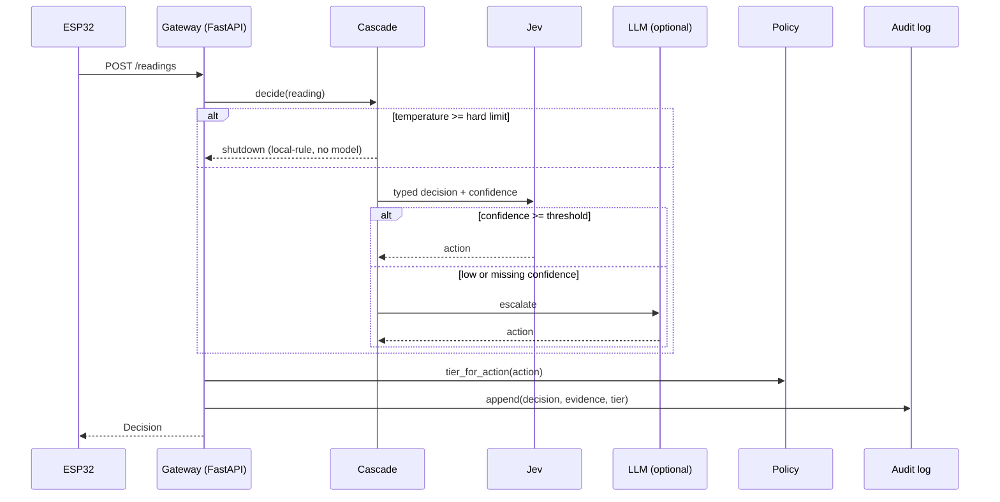

# Architecture

## Flow

## Layers

| Layer | File | Responsibility |
|---|---|---|
| Firmware | `firmware/src/main.cpp` | Read sensors, report over Wi-Fi |
| Cascade | `agent/cascade.py` | Choose an action; degrade to rules if any model layer fails |
| Policy | `agent/policy.py` | Per-operation risk table; approvals with expiry and single use |
| Audit | `agent/audit.py` | Hash-chained append-only log with verification |
| Auth | `agent/auth.py` | Bearer tokens for devices and operators, identity from token |
| API | `agent/app.py` | Ingest, history, approval workflow, audit verification |

## Failure behavior

| Failure | Result |
|---|---|
| Jev raises or times out | Rule-based decision, `escalated=true` |
| Jev confidence below threshold or missing | LLM if configured, otherwise rules |
| LLM raises | Rule-based decision |
| Temperature at or above the hard limit | Shutdown decided locally; no model is called |
| Unknown operation requested | Denied and audited |
| Approval expired, reused, or self-approved | Rejected and audited |

## Trust boundaries

- Risk tiers come from a fixed table, never from model output.
- Model layers can only choose among the four `Action` values.
- The audit chain detects edits and deletions. It cannot stop someone with file access from rewriting the whole chain.
- Devices and operators authenticate with static bearer tokens from the environment (`agent/auth.py`); requester and approver identities come from the token, so self-approval is enforced against authenticated names. With no tokens configured, auth is disabled and identities are self-declared. The tokens are shared secrets with no rotation and no TLS here; do not expose the API beyond a trusted network.
